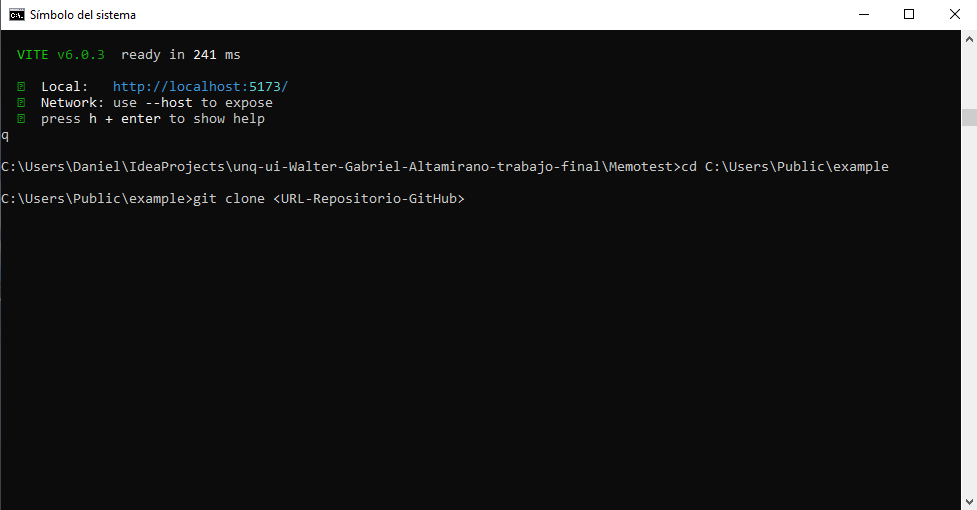
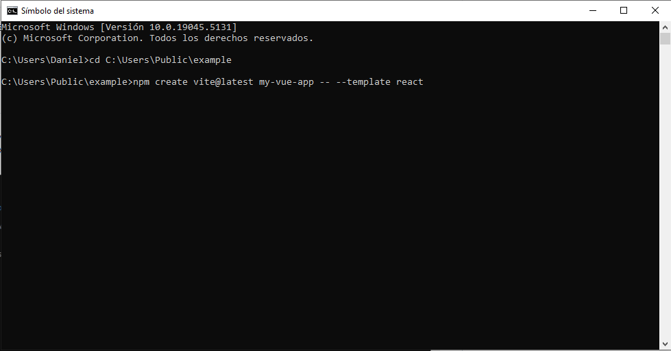
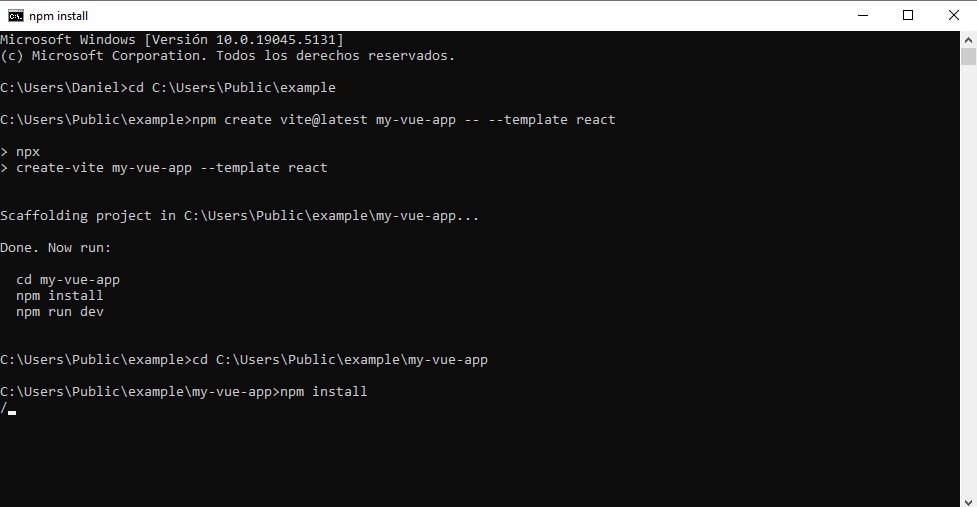
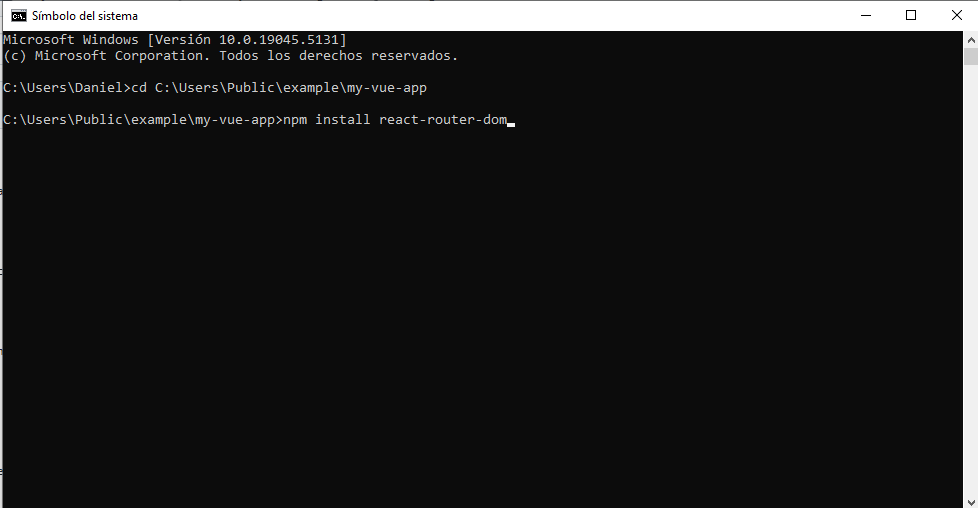
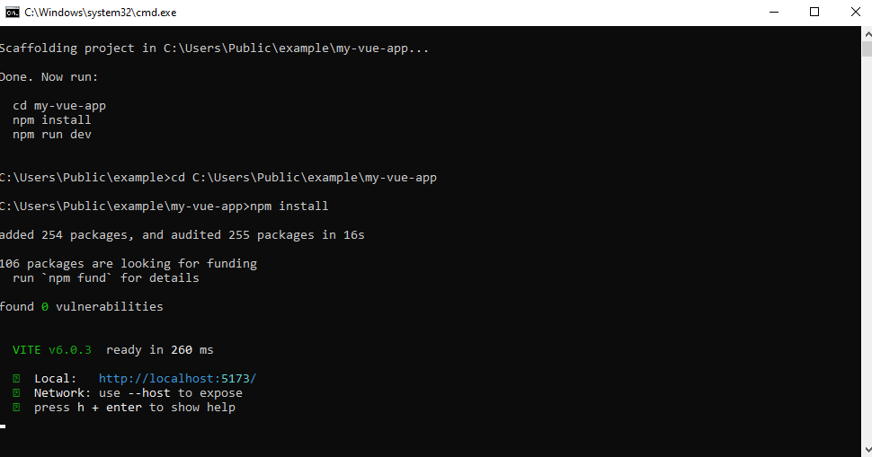
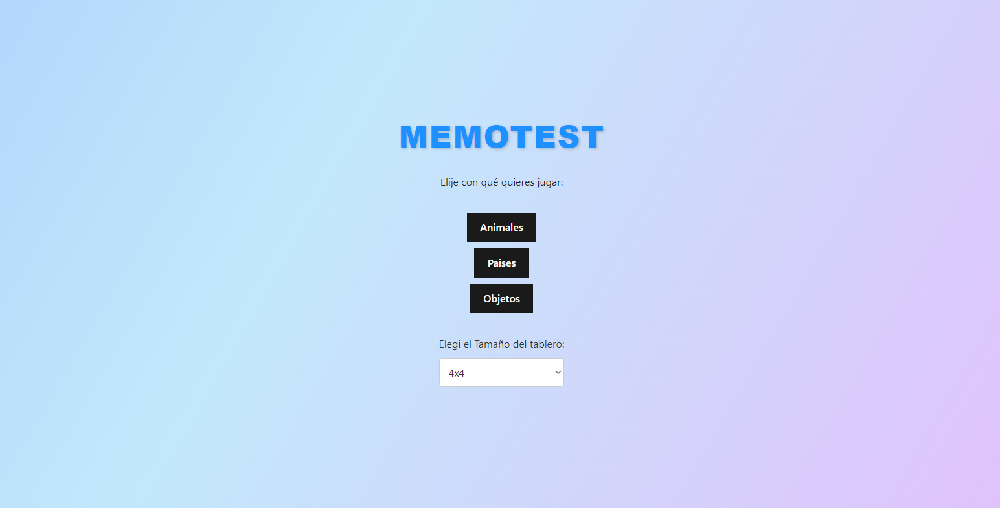
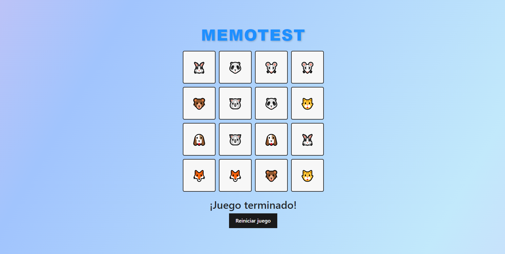
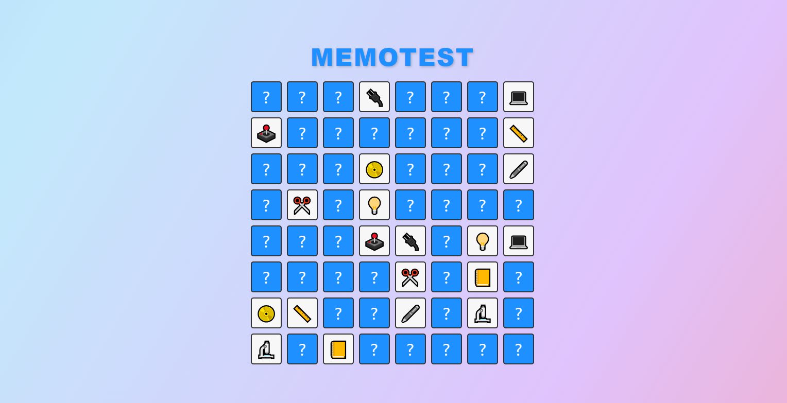

# unq-ui-Walter-Gabriel-Altamirano-trabajo-final
Trabajo Integrador Final -- Construcción de Interfaces de Usuario

# MEMOTEST
Requisitos previos para descargar el proyecto:
 
 *Tener instalado Node.js --> https://nodejs.org/en/
   *Descargar la version LTS*

# Descarga del proyecto y su Instalacion :
Para descargar el proyecto, se debe ejecutar el comando "git clone <URL-del-proyecto>" en la consola de su sistema operativo ("cmd" en Windows,"prompt" en linux), en el directorio que desea guardarlo.

  

Una vez hecho lo anterior, instalar los archivos necesarios para poder ejecutar el juego. *Comando a ejecutar " npm create vite@latest my-vue-app -- --template react "*:

  

Por ultimo, ubicarse en el directorio creado para instalar la app con *"npm install"* y luego una dependencia necesaria para futuras versiones... Ejecutar *"npm install react-router-dom"* para luego ejecutar *"npm run dev"* y asi, inicializar el juego:

  

  
  
  

Abrir el navegador y escribir en la URL el siguiente link: http://localhost:5173/

# Juego

# Reglas del Juego
Las reglas son sencillas: consiste en una grilla o cuadrícula de tamaño variable, en la cual se esconden pares de objetos: pueden ser animales, capitales y países, números y sus dobles, etc. Los jugadores deben ir descubriendo las celdas de a una e ir recordando dónde está cada pieza del par, para así reunirlos y sumar puntos. El objetivo es lograr reunir la mayor cantidad de pares. El jugador que reúne la mayor cantidad de pares es el ganador. Concluye cuando todos los pares de la grilla son formados.

